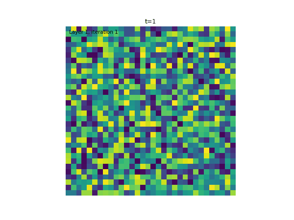
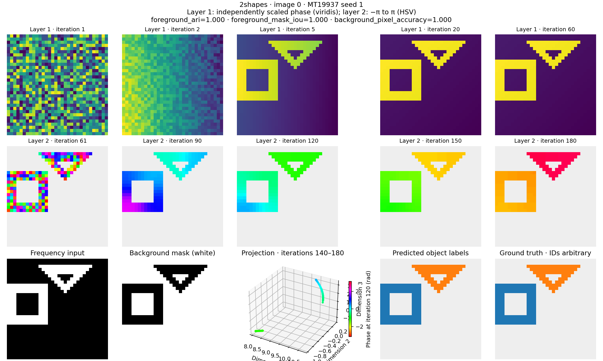
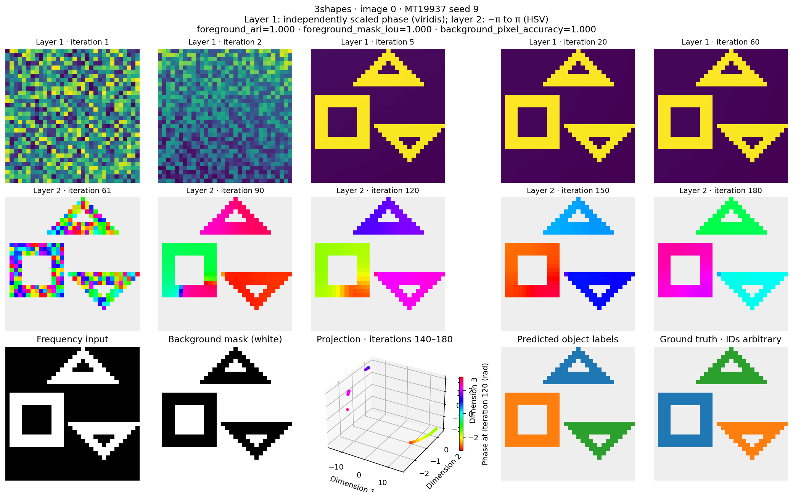
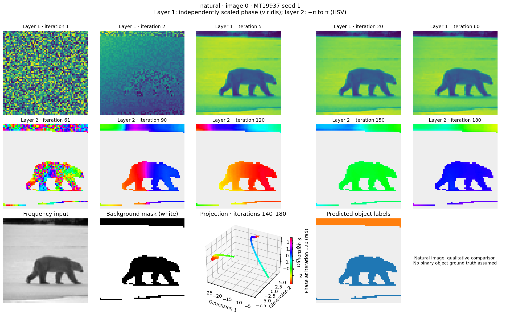

# CV-RNN: Complex-Valued Recurrent Neural Networks for Image Segmentation and Computation

This repository implements complex-valued recurrent neural networks (cv-RNNs) in PyTorch. The networks segment images and perform computational tasks from these papers:

- [Image segmentation with traveling waves in an exactly solvable recurrent neural network](https://doi.org/10.1073/pnas.2321319121) by Liboni et al. (PNAS, 2025). The preprint is [arXiv:2311.16943](https://arxiv.org/abs/2311.16943).
- [An exact mathematical description of computation with transient spatiotemporal dynamics in a complex-valued neural network](https://doi.org/10.1038/s42005-024-01728-0) by Budzinski et al. (2024).

## Overview

Each node stores a complex number with an amplitude and a phase. Linear dynamics produce patterns that change across nodes and over time. These phase patterns support image segmentation and computation. Closed-form mathematical expressions describe the network dynamics.

The networks use **fixed weights**. They do not need the training that traditional deep-learning methods require.



## Features

- **Image segmentation:** The network separates objects through traveling waves of synchronized phases.
- **XOR computation:** The implementation reproduces the MATLAB example. It calculates complex inputs through inverse evolution and adds the inputs. A decoder reads phase synchrony in their shared target cluster.
- **Short-term memory:** The implementation reproduces the eight-item MATLAB task, including sequential recall and memory clearing.
- **Experimental message transmission:** The demo represents letters and spaces through temporary clusters of aligned phases. It does not provide secure encryption.

## Installation

```bash
# Clone the repository
git clone https://github.com/danbarua/posn.git
cd posn

# Install the Python version and dependencies from the committed lockfile
uv sync --locked

# Run commands through the project environment
uv run --locked python -m pytest -q
```

## Usage

### Image Segmentation



`src/cv_rnn/cv_rnn_segmentation.py` implements two upstream MATLAB functions:

- `matlab/liboniEA2025image/image_segmentation/run_2layer.m`
- `spatiotemporal_segmentation.m`

The implementation uses the raw recurrence `x ← (K + i·diag(ω))x` in two layers. It uses neither an Euler step nor normalization to the unit circle. A strict-majority rule based on mean phase identifies the background. Clustering uses only phase information from time windows that include both endpoints. State vectors follow MATLAB's column-major pixel order.

Run these commands from the repository root with uv. The repository includes `datasets/2shapes.mat`, `3shapes.mat`, and `natural_image.mat`. You do not need to download datasets or install MATLAB.

```bash
uv run --locked python -m src.cv_rnn segmentation --dataset 2shapes --image-index 0 --n-clusters 2
uv run --locked python -m src.cv_rnn segmentation --dataset natural --n-clusters 2 --plot
uv run --locked python -m pytest tests/test_segmentation_math.py tests/test_segmentation_animation.py -q
```

`--plot` shows these results in one window:

- The input image.
- The background mask.
- The cluster map.
- The animated phase dynamics.
- The projection for spectral clustering.

The layer-1 animation uses viridis with a separate scale for each frame, as in paper Fig. 3A. Only layer 2 uses HSV with a fixed range of [-π, π]. The following images show saved results.





```python
import torch
from src.cv_rnn import (
    run_2layer_torch,
    spatiotemporal_segmentation_torch,
    animate_dynamics,
)

image = torch.zeros(32, 32, dtype=torch.float64)  # frequencies, radians/step
states, mask = run_2layer_torch(image, generator=torch.Generator().manual_seed(1))
cluster_map, rho, V, D, projection = spatiotemporal_segmentation_torch(
    states, image, mask, n_clusters=2, nt_mask=60,
)
fig, anim = animate_dynamics(states, tuple(image.shape))
```

`rho`, `V`, `D`, and `projection` contain only foreground nodes in their original pixel order. The mask excludes background nodes. `cluster_map` has the image shape and uses `-1` for background pixels.

`tests/test_segmentation_math.py` checks the recurrence, masking, and eigensystem against independent NumPy/SciPy equations. It does not use production helpers as references.

`tests/test_image_segmentation.py` compares Python results with upstream MATLAB functions that GNU Octave executes. The test uses exported reference data, called fixtures, in `datasets/{2shapes,3shapes,natural}_ref.mat`.

Run these commands to regenerate all three fixtures. You need Docker for this step.

```bash
git submodule update --init --recursive
docker build -t octave:optimized .
docker run --rm -v "$PWD:/work" \
  -e SCRIPT=/work/matlab/export_segmentation_references.m octave:optimized
uv run --locked python -m pytest tests/test_image_segmentation.py -q
```

#### Reference fixtures

The Dockerfile includes `octave-statistics` for the upstream `pdist2` and `kmeans` functions. `$SCRIPT` defaults to `/matlab/hello_world.m` unless you specify another path. The bind mount stores exported files in the host repository.

The exporter does not create figures. The three examples took about three minutes on the development machine. Octave 6.4 needs `matlab/octave_compat/rng.m` for upstream `rng(seed)` calls. This adapter seeds Octave's supported APIs for random states.

The fixtures use MATLAB binary format through `save('-v7', ...)`, not Octave's default text format. Each fixture contains:

- The input image.
- The complex initial state.
- The numerical parameters.
- The full complex128 trajectory.
- The background mask.
- The final correlation matrix.
- The cluster labels.
- The runtime version and upstream source text, which record how the exporter produced the fixture.

Tests share actual arrays across runtimes. They do not assume that equal seeds produce equal arrays.

#### Numerical agreement and segmentation quality

All three references match Python trajectories and correlations at `rtol=1e-10, atol=1e-12`. The masks match exactly. Both implementations apply the same rule to standardize each eigenvector's global phase (phase canonicalization). The resulting real projections agree at `rtol=1e-9, atol=1e-11`.

Adjusted Rand Index (ARI) compares partitions without requiring identical label numbers. ARI=1.0 means the partitions agree. Applying sklearn `KMeans(n_init=1, random_state=0)` to both projections gives ARI=1.0. This check uses the same algorithm on arrays that already agree to about 4e-12. It does not establish agreement with Octave's `kmeans` algorithm.

The `3shapes` fixture does not separate the objects clearly under the exported Octave initial state, `x0`. The measured ARIs are:

- Python against ground truth: 0.496.
- Octave `kmeans` against ground truth: 0.077.
- Python against Octave `kmeans`: about 0.40.

Do not use this fixture as evidence of segmentation quality. The bundled Python demo with seed 9 still gives ARI=1.0, but it uses a different initial state. The references check GNU Octave 6.4 execution of MATLAB source. They do not check execution in proprietary MATLAB.

`run_segmentation_example` uses the demo seeds: 1 for `2shapes` and 9 for `3shapes`. Every bundled shape image gives foreground ARI=1.0 with these seeds. `tests/test_segmentation_objects.py` checks these results.

Other seeds do not reproduce these results consistently. A sweep across 20 random seeds gives mean foreground ARI of about 0.6 on the same images. The minimum is near 0. Bypassing phase canonicalization does not remove this difference. The initial state affects clustering quality even when projections agree across runtimes.

See [`docs/references/04_paper_vs_matlab_drift.md`](docs/references/04_paper_vs_matlab_drift.md) and `scripts/probe_paper_vs_matlab_drift.py` for the measurements. These files also describe measured differences between the preprint, published paper, and MATLAB code.

#### Eigenmode plots

`scripts/plot_segmentation_eigenmodes.py` examines the layer-2 recurrence matrix `B = K + i*diag(omega)` for both bundled `2shapes` images. The plots follow the style of Figure 6 and show:

- Eigenvalue magnitudes and phases.
- Phase maps for the six leading eigenvectors.
- The decrease in modal weights.
- Reconstructions of the raw trajectory using all modes and only six modes.

These plots provide comparable diagnostics, not an exact reproduction. The upstream code has no driver for Figs. 5/6. The bundled images contain only two discrete frequencies. Their eigenvectors are piecewise real, with `Arg` ∈ {0, π}, rather than the paper's continuous phase gradients.

`--synthetic` creates a frequency gradient within each object. This clearly labeled synthetic input differs from the bundled data. The same analysis then produces traveling-wave modes comparable to Fig. 6B.

```bash
uv run --locked python scripts/plot_segmentation_eigenmodes.py
uv run --locked python scripts/plot_segmentation_eigenmodes.py --synthetic
```

#### Natural-image scores

The `lb` key in `natural_image.mat` contains ground truth for ARI comparisons. It maps 16 regions, such as sky, ground, and bear. Region IDs are arbitrary, as they are in `2shapes` and `3shapes`. Unlike the shape datasets' `labels`, this map does not use `0` to identify background.

`SegmentationExample.scores()` returns one whole-image `ari` for `natural`. It does not return `foreground_ari`, `foreground_mask_iou`, or `background_pixel_accuracy` for this dataset. The region map provides no defined foreground/background split for these scores.

### XOR Computation

The Python implementation follows `matlab/budzinskiEAexact/cvnn_xor_gate.m` with these parameters:

- 201 nodes.
- Coupling strength 50.
- Phase lag 1.56.
- Natural frequency 10 Hz.
- Target time 3 seconds.

Both inputs target MATLAB nodes 51:150, or Python slice `50:150`. Their target phases are -1.5 and +1.5, with independent, nonuniform amplitudes. The implementation calculates initial states through inverse evolution. It adds simultaneous inputs rather than multiplying them. One synchrony threshold decodes the result without applying Boolean XOR in Python.


Run these commands from the repository root with uv. You do not need MATLAB.

```bash
uv run --locked python -m src.cv_rnn xor
uv run --locked python -m src.cv_rnn xor --plot
uv run --locked python -m pytest tests/test_xor_cv_nn.py tests/test_local_synchrony.py -q
```

The first command prints the truth table without opening plots. `--plot` shows all four trajectories and their final phases.

```python
from src.cv_rnn import XorCVNN

gate = XorCVNN()
table = gate.truth_table(seed=1)  # {(0, 0): 0, (1, 0): 1, (0, 1): 1, (1, 1): 0}
inputs = gate.xor_inputs(target_time=3.0, seed=1)
trajectory = gate.evolve(inputs[(1, 0)], [0.0, 1.0, 2.0, 3.0])  # (nodes, times)
```

Propagation uses double-precision fast Fourier transforms (FFTs). These transforms are equivalent to the reference's analytical Fourier eigensystem. `design_input(target, target_time)` accepts external complex targets for comparisons. Preserve the amplitudes of these targets.

The default synchrony threshold is 0.8. This threshold is a decoder choice, not a value from the MATLAB plotting script. Other seeds or network sizes might not separate at this threshold.

Tests check:

- Full complex states against an independent SciPy matrix exponential.
- Targets calculated through inverse evolution.
- Interference between added inputs.
- The actual decoder.

These tests do not compare execution across Python and MATLAB/Octave. Equal PyTorch and MATLAB seeds do not generate equal samples. Use shared target arrays and initial-state arrays for such a comparison.

### Memory Task

`src/cv_rnn/cv_nn_memory.py` implements the task from `matlab/budzinskiEAexact/cvnn_memory_task.m` with these parameters:

- 321 nodes.
- Coupling strength 45.
- Phase lag 1.55.
- Natural frequency 10 Hz.

Memory and XOR share the double-precision Fourier solver in `src/cv_rnn/cv_nn.py`.


```bash
uv run --locked python -m src.cv_rnn memory
uv run --locked python -m src.cv_rnn memory --plot
uv run --locked python -m pytest tests/test_memory_cv_nn.py tests/test_xor_cv_nn.py tests/test_local_synchrony.py -q
```

Run the demos through `uv run --locked python -m src.cv_rnn`, not through individual source files. `--seed` selects a reproducible PyTorch run and defaults to 1. You do not need MATLAB.

The reference sequence is:

| Interval | State initialization and purpose |
|----------|----------------------------------|
| 0–1 s | Random unit-amplitude background |
| 1–4 s | Inverse-designed input for item 2 |
| 4–7 s | Inverse-designed input for item 6 |
| 7–8 s | Independent random background, clearing the memory |

Both targets use phase zero in the selected 40-node block and random phases outside the block. Their amplitudes are in `[2, 2.5)`. Item numbers range from 1 to 8. Node 321 belongs to the network but lies outside the eight equal-sized decoder groups.

**The state changes at each segment boundary.** The MATLAB loops replace the shared sample at 1, 4, and 7 seconds. Each replacement uses the next segment's initial state. The Python timeline does the same.

The exact recall states occur immediately before the updates at 4 and 7 seconds. Python returns these states separately. It does not substitute them into the timeline.

```python
from src.cv_rnn import MemoryCVNN

memory = MemoryCVNN()
result = memory.run(items=(2, 6), seed=1)
result.trajectory       # complex (321, 8001), including the final 8 s sample
result.recall_times     # [4.0, 7.0], interpreted immediately before each update
result.recall_states    # complex (321, 2), independent of overwritten samples
memory.decode(result.recall_states)  # boolean (8, 2): item 2, then item 6
```

The default time step is 1 ms. Other `dt` values must divide one second exactly. The decoder checks each group's phase synchrony independently against a threshold of 0.8. It does not force one item to win.

The decoder and the additional synchrony plot follow the paper. The MATLAB script only plots phase dynamics. Tests check:

- Agreement with an independent matrix exponential.
- Sample replacement at cue boundaries.
- Recall and memory clearing.
- Exclusion of the unassigned node from decoding.

A comparison across Python and MATLAB/Octave still requires shared numerical inputs.

### Message Transmission Demo

`src/cv_rnn/cv_nn_message.py` implements an experimental protocol that adds inputs and assigns each character a time frame. The protocol follows ideas from the paper, but it does not reproduce Figure 4 exactly. The local input description does not clearly specify addition or multiplication. The original alphabet from Supplementary Note 8 is not available locally.


```bash
uv run --locked python -m src.cv_rnn message
uv run --locked python -m src.cv_rnn message --text "HELLO WORLD" --plot
uv run --locked python -m src.cv_rnn message --receiver-frequency-hz 9
uv run --locked python -m src.cv_rnn message --receiver-seed 99
uv run --locked python -m pytest tests/test_message_cv_nn.py tests/test_memory_cv_nn.py tests/test_xor_cv_nn.py tests/test_local_synchrony.py -q
```

The input must contain at least one character and use only uppercase `A-Z` and spaces. The demo preserves leading spaces, trailing spaces, and repeated letters. It rejects unsupported characters instead of silently changing them.

The command options are:

- `--seed` controls reproducible sender experiments and defaults to 1.
- `--frequency-hz` sets the sender frequency and defaults to 10.
- Receiver overrides permit experiments with a different frequency or initial state.
- `--dt` sets the receiver's sampling interval and defaults to 0.01 seconds.

The commands use the project environment that uv manages.

The public alphabet uses 27 contiguous blocks of 16 nodes, for 432 nodes in total. The coupling strength is 45, and the phase lag is 1.55. Each character occupies a three-second frame.

Each complex target has phase zero in the selected block and random phases outside that block. The target has independent amplitudes in `[2, 2.5)`. The sender privately chooses a target delay between 35% and 50% of the frame duration.

For each input at time `t`, the sender calculates `impulse = D(-delay) @ target - state_before_input`. The receiver adds this pulse to its current state. The receiver never receives a replacement state or a target.

`Ciphertext` contains only ordered `InputEvent` vectors, their times, and the final observation time. The alphabet and network configuration are public. `MessageKey` contains the frequency and initial state.

```python
from src.cv_rnn import MessageDemo

sender = MessageDemo()
key = sender.make_key(seed=1, frequency_hz=10.0)
ciphertext = sender.encode("HELLO WORLD", key, seed=1)

receiver = MessageDemo()  # independent of the sender
trace = receiver.receive(ciphertext, key)
decoded = receiver.decode_frames(trace)
text = "".join("?" if item.symbol is None else item.symbol for item in decoded)
```

The decoder searches each input frame without access to private target times. Each frame includes its start time but excludes its end time. The decoder selects the strongest local-coherence peak, which measures phase alignment within a block. It compares the other blocks **at that same instant**.

The default decoder accepts a frame only when synchrony is at least 0.9 and the margin is at least 0.15. It returns `symbol=None` for a rejected frame, which the output shows as `?`. A space is a separate alphabet symbol, not a rejected frame.

The decoder returns exactly one result per frame. This rule avoids duplicate detections from repeated threshold crossings without deleting genuine repeated letters. The plots show:

- The receiver's full phase dynamics.
- A heatmap of symbol coherence.
- Public frame boundaries.
- Observed peaks, not the sender's target annotations.

**Do not use this demo for confidentiality or authentication.** A 9 Hz receiver with the same initial state decodes `HELLO` from the default 10 Hz sender. The common phase rotation aliases at the three-second input spacing. A different initial state does not guarantee that every character remains hidden. The default experiment with `--receiver-seed 99` currently returns `H????`.

The CLI reports these results instead of forcing a wrong-key failure. Seeds make experiments reproducible. They do not provide cryptographic randomness.


The demo simulates transmission in memory. It does not provide network transport or a secure file format. Public frames reveal message length. Each default character uses 6912 bytes of complex pulse data, excluding timing and metadata.

Coarse sampling can miss peaks. Long transmissions and adverse parameters can amplify roundoff and state errors. The implementation does not conceal failures through seed retries, normalization, or automatic corrections.

Tests check:

- Impulse dynamics against an independent reference.
- Target recovery with private delays.
- Separate receivers.
- Repeated peaks and letters.
- Spaces versus rejected frames.
- The frequency-alias counterexample.

## Key Concepts

### Complex-Valued Neural Networks

Each cv-RNN node has a complex-valued state:

- The amplitude represents intensity information.
- The phase represents object identity.
- Linear dynamics produce patterns that change across nodes and over time.

### Two-Layer Architecture for Image Segmentation

1. Layer 1 separates foreground objects from the background.
2. Layer 2 separates individual objects through distinct traveling waves.

### Exact Mathematical Framework

The continuous-time network follows this differential equation:

```
ẋ(t) = (iωI + ϵe^(-iϕ)A)x(t)
```

The symbols are:

- x(t): the complex-valued state vector.
- ω: the intrinsic frequency.
- ϵ: the coupling strength.
- ϕ: the phase-lag parameter.
- A: the connectivity matrix.

## Comparison with Traditional Methods

The cv-RNN approach uses fixed weights without training. Closed-form expressions give exact solutions for the dynamics. Patterns across nodes and time support different tasks. The approach offers a biologically plausible mechanism for computation.

Liboni et al. report these segmentation results in the 2025 paper's *SI Appendix*, section III:

- 93% of pixels correctly clustered across 1,000 nonoverlapping two-shape images.
- 86% of pixels correctly clustered across 1,000 nonoverlapping three-shape images.

See `docs/references/02_supplementary.md` for the source. These values measure the fraction of correctly clustered pixels, not ARI. The paper reports no comparison against K-means, watershed, or U-Net on this task. An earlier README table fabricated such a comparison. This README no longer includes that table.

This repository reports per-image scores for the three bundled examples:

- `foreground_ari` and `background_pixel_accuracy` for `2shapes` and `3shapes`.
- Whole-image `ari` for `natural`, as described in Image Segmentation.

These scores do not reproduce the paper's 1,000-image benchmark. The repository does not include that benchmark.

## Citations

If you use this code in research, cite the original papers:

```bibtex
@article{liboni2025image,
  title={Image segmentation with traveling waves in an exactly solvable recurrent neural network},
  author={Liboni, Luisa H. B. and Budzinski, Roberto C. and Busch, Alexandra N. and L{\"o}we, Sindy and Keller, Thomas A. and Welling, Max and Muller, Lyle E.},
  journal={Proceedings of the National Academy of Sciences},
  volume={122},
  number={1},
  pages={e2321319121},
  year={2025},
  doi={10.1073/pnas.2321319121}
}

@article{budzinski2024exact,
  title={An exact mathematical description of computation with transient spatiotemporal dynamics in a complex-valued neural network},
  author={Budzinski, Roberto C. and Busch, Alexandra N. and Mestern, Samuel and Martin, Erwan and Liboni, Luisa H. B. and Pasini, Federico W. and Min{\'a}{\v{c}}, J{\'a}n and Coleman, Todd and Inoue, Wataru and Muller, Lyle E.},
  journal={Communications Physics},
  volume={7},
  number={1},
  pages={239},
  year={2024},
  publisher={Nature Publishing Group UK London}
}
```

## Acknowledgments

This implementation follows work by researchers at Western University, the University of Amsterdam, and other institutions. We acknowledge their contributions. Read the original papers for the mathematical details and theory.

## License

This project uses the MIT License. See the LICENSE file for details.
