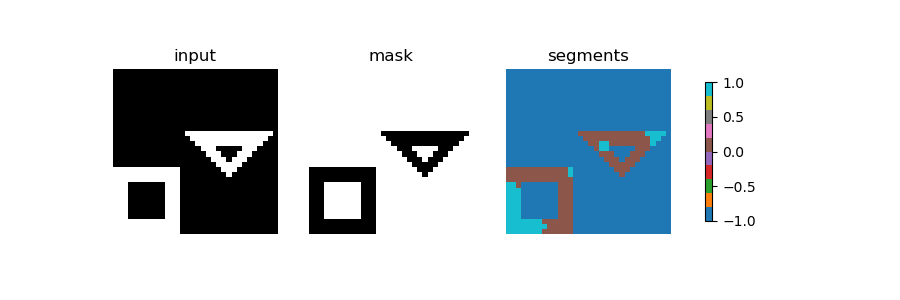
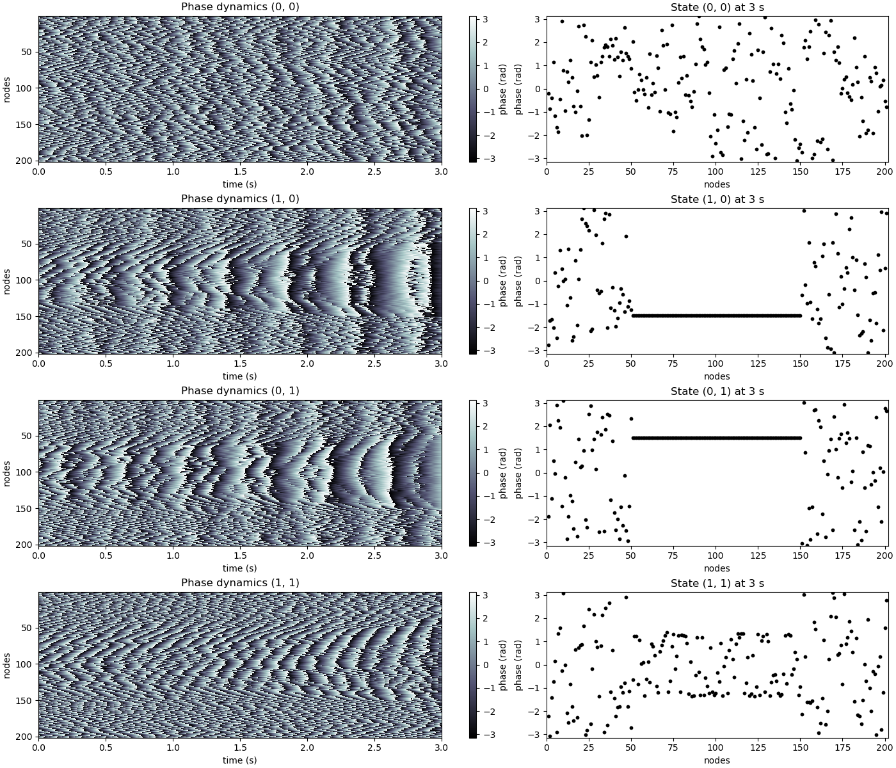
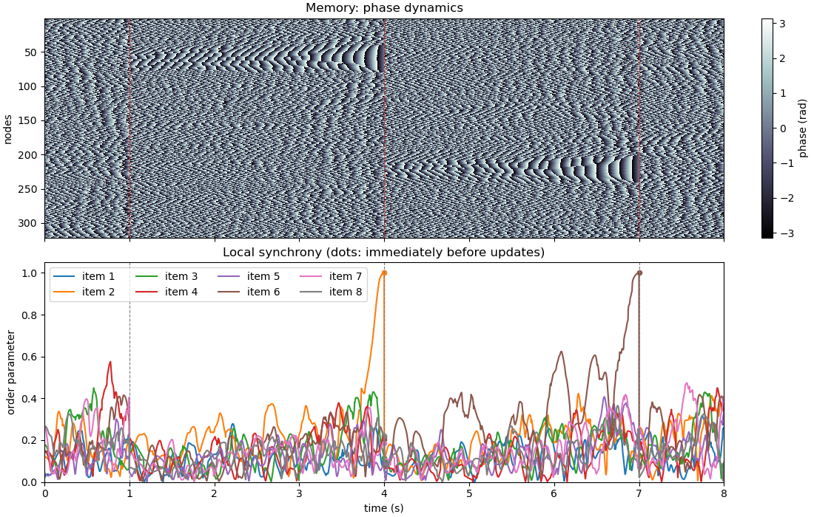
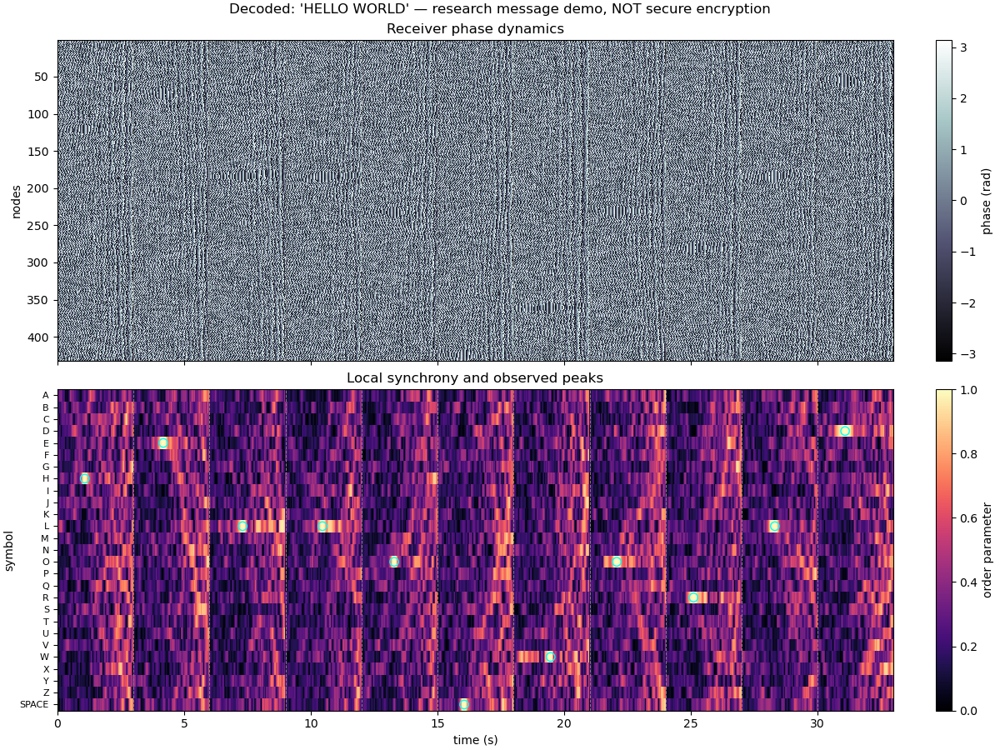
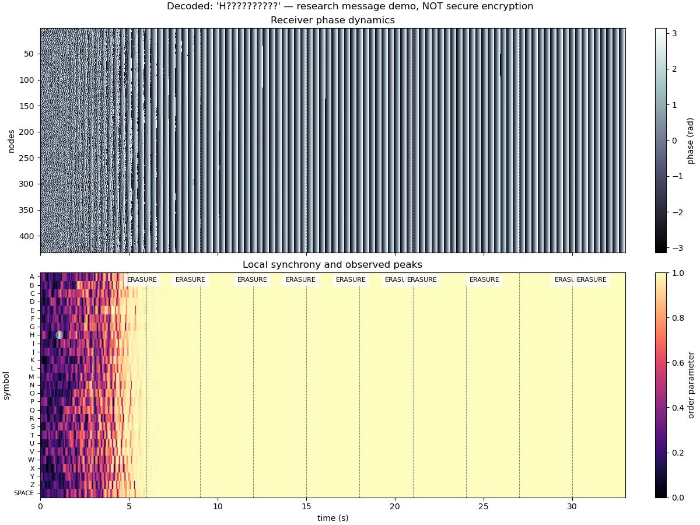

# CV-RNN: Complex-Valued Recurrent Neural Networks for Image Segmentation and Computation

This repository provides a PyTorch implementation of Complex-Valued Recurrent Neural Networks (cv-RNNs) for image segmentation and computational tasks as described in the following papers:

- [Image segmentation with traveling waves in an exactly solvable recurrent neural network](https://arxiv.org/abs/2311.16943) by Liboni et al. (2023)
- [An exact mathematical description of computation with transient spatiotemporal dynamics in a complex-valued neural network](https://doi.org/10.1038/s42005-024-01728-0) by Budzinski et al. (2024)

## Overview

This project explores a novel approach to neural network design where:

- Each node has a state represented by a complex number (with amplitude and phase)
- The network uses linear dynamics but exhibits rich spatiotemporal patterns
- These phase patterns enable image segmentation and computation
- The entire system is "exactly solvable" with closed-form mathematical expressions

Unlike traditional deep learning approaches that require extensive training, these cv-RNNs perform tasks like image segmentation using sophisticated spatiotemporal dynamics with a *single set of fixed weights*.


## Features

- **Image Segmentation**: Segment objects in images using traveling waves of phase synchronization
- **XOR Computation**: Reproduce the MATLAB example using inverse-designed complex inputs, additive interference, and a shared-cluster synchrony decoder
- **Short-Term Memory**: Reproduce the eight-item MATLAB memory task, including sequential recall and clearing
- **Message Transmission (Experimental)**: Encode letters and spaces as transient phase-coherent clusters; this is not secure encryption

## Installation

```bash
# Clone the repository
git clone https://github.com/danbarua/posn.git
cd cv-rnn

# Create and activate a virtual environment (optional)
python -m venv venv
source venv/bin/activate  # On Windows: venv\Scripts\activate

# Install dependencies
pip install -r requirements.txt
```

## Usage

### Image Segmentation



```python
from cvrnn import CVRNN

# Initialize the CV-RNN
cvrnn = CVRNN(device="cuda" if torch.cuda.is_available() else "cpu")

# Load an image
img = load_test_image('shapes', size=64)

# Segment the image
segments, dynamics = cvrnn.segment(
    img, 
    a_vals=[0.5, 0.5],      # Connection strengths [layer1, layer2]
    s_vals=[0.9, 0.0313],   # Spatial scales [layer1, layer2]
    nt=[60, 140],           # Time steps [end of layer1, total]
    n_clusters=3            # Number of clusters for segmentation
)

# Visualize the results
visualize_segmentation(img, segments, dynamics)
```

### XOR Computation

The Python implementation follows `matlab/budzinskiEAexact/cvnn_xor_gate.m`:
201 nodes, coupling strength 50, phase lag 1.56, natural frequency 10 Hz, and
target time 3 seconds. Both inputs target MATLAB nodes 51:150 (Python slice
`50:150`), at phases -1.5 and +1.5 with independent, nonuniform amplitudes.
Initial states are calculated by inverse evolution; simultaneous inputs are
added, not multiplied. One synchrony threshold decodes the result without
applying Boolean XOR in Python.



Run from the repository root in the existing Conda environment; no dependency
sync or MATLAB installation is needed:

```bash
conda activate posn
python -m src.cv_rnn xor
python -m src.cv_rnn xor --plot
python -m pytest tests/test_xor_cv_nn.py tests/test_local_synchrony.py -q
```

The first command prints the truth table without opening plots. `--plot`
displays all four trajectories and their final phase snapshots.

```python
from src.cv_rnn import XorCVNN

gate = XorCVNN()
table = gate.truth_table(seed=1)  # {(0, 0): 0, (1, 0): 1, (0, 1): 1, (1, 1): 0}
inputs = gate.xor_inputs(target_time=3.0, seed=1)
trajectory = gate.evolve(inputs[(1, 0)], [0.0, 1.0, 2.0, 3.0])  # (nodes, times)
```

Propagation uses double-precision FFTs equivalent to the reference's analytical
Fourier eigensystem. `design_input(target, target_time)` supports comparisons
using externally supplied complex targets; preserve their amplitudes.
The default synchrony threshold is 0.8, a decoder choice rather than a value
specified by the MATLAB plotting script. Other seeds or network sizes are not
guaranteed to separate at that threshold.

Tests compare full complex states with an independent SciPy matrix exponential,
check inverse-designed targets and additive interference, and exercise the
actual decoder. This is not yet a MATLAB/Octave cross-runtime verification:
equal PyTorch and MATLAB seeds do not generate equal samples. Use shared target
and initial-state arrays for that comparison.

### Memory Task

`src/cv_rnn/cv_nn_memory.py` ports
`matlab/budzinskiEAexact/cvnn_memory_task.m`: 321 nodes, coupling strength 45,
phase lag 1.55, and natural frequency 10 Hz. It shares the double-precision
Fourier solver in `src/cv_rnn/cv_nn.py` with XOR.



```bash
python -m src.cv_rnn memory
python -m src.cv_rnn memory --plot
python -m pytest tests/test_memory_cv_nn.py tests/test_xor_cv_nn.py tests/test_local_synchrony.py -q
```

The demos use the package entry point (`python -m src.cv_rnn`), rather than
executing individual source files. `--seed` selects a reproducible PyTorch run;
the default is 1. No environment synchronization or MATLAB installation is needed.

The reference sequence is:

| Interval | State initialization and purpose |
|----------|----------------------------------|
| 0–1 s | Random unit-amplitude background |
| 1–4 s | Inverse-designed input for item 2 |
| 4–7 s | Inverse-designed input for item 6 |
| 7–8 s | Independent random background, clearing the memory |

Both targets have phase zero in the selected 40-node block, random outside
phases, and amplitudes in `[2, 2.5)`. Items are numbered 1–8. Node 321 remains
part of the network but is outside the eight equal-sized decoder groups.

**Boundary semantics matter:** the MATLAB loops overwrite the shared sample at
1, 4, and 7 seconds with the new segment's initial state. The Python timeline
does the same. The exact recall states immediately before the updates at 4 and
7 seconds are therefore returned separately, not substituted into the timeline.

```python
from src.cv_rnn import MemoryCVNN

memory = MemoryCVNN()
result = memory.run(items=(2, 6), seed=1)
result.trajectory       # complex (321, 8001), including the final 8 s sample
result.recall_times     # [4.0, 7.0], interpreted immediately before each update
result.recall_states    # complex (321, 2), independent of overwritten samples
memory.decode(result.recall_states)  # boolean (8, 2): item 2, then item 6
```

The default time step is 1 ms; alternate `dt` values must divide one second.
The decoder thresholds each group's phase synchrony independently at 0.8;
it does not force an item to win. This decoder and the additional synchrony
plot follow the paper; the MATLAB script itself only plots phase dynamics.
Tests cover independent matrix-exponential agreement, cue-boundary overwrites,
recall and clearing, and exclusion of the unassigned node from decoding.
MATLAB/Octave cross-runtime verification still requires shared numerical inputs.

### Message Transmission Demo

`src/cv_rnn/cv_nn_message.py` implements an **additive, framed research protocol**.
It is inspired by the paper, not an exact reproduction of Figure 4: the local
input description is ambiguous about addition versus multiplication, and the
original alphabet in Supplementary Note 8 is not available locally.



```bash
python -m src.cv_rnn message
python -m src.cv_rnn message --text "HELLO WORLD" --plot
python -m src.cv_rnn message --receiver-frequency-hz 9
python -m src.cv_rnn message --receiver-seed 99
python -m pytest tests/test_message_cv_nn.py tests/test_memory_cv_nn.py tests/test_xor_cv_nn.py tests/test_local_synchrony.py -q
```

Input must be nonempty uppercase `A-Z` and spaces. Leading/trailing spaces and
repeated letters are preserved; unsupported characters are rejected, not silently
normalized. `--seed` defaults to 1 and controls reproducible sender experiments.
`--frequency-hz` defaults to 10; receiver overrides intentionally allow mismatched
frequency or initial-state experiments. `--dt` sets receiver sampling, default
0.01 seconds. All commands use the existing Conda dependencies without downloads.

The public alphabet uses 27 contiguous blocks of 16 nodes (432 total), with
coupling strength 45 and phase lag 1.55. Each character gets a three-second
frame. Its complex target has phase zero in the selected block, random phases
outside, and independent amplitudes in `[2, 2.5)`. The sender privately chooses
a target delay between 35% and 50% of the frame duration.

For each input at time `t`, the sender calculates
`impulse = D(-delay) @ target - state_before_input`.
The receiver **adds** that pulse to its own running state; it never receives a
replacement state or target. `Ciphertext` contains only ordered `InputEvent`
vectors/times and the final observation time. The alphabet and network
configuration are public; frequency and initial state belong to `MessageKey`.

```python
from src.cv_rnn import MessageDemo

sender = MessageDemo()
key = sender.make_key(seed=1, frequency_hz=10.0)
ciphertext = sender.encode("HELLO WORLD", key, seed=1)

receiver = MessageDemo()  # independent of the sender
trace = receiver.receive(ciphertext, key)
decoded = receiver.decode_frames(trace)
text = "".join("?" if item.symbol is None else item.symbol for item in decoded)
```

The decoder searches each half-open input frame without seeing private target
times. It selects the strongest local-coherence peak and compares other blocks
**at that same instant**. Default acceptance requires synchrony at least 0.9 and
a margin of at least 0.15. Rejected frames return `symbol=None` (displayed as `?`);
a space is a separate alphabet symbol. Exactly one result per frame avoids
duplicate threshold-crossing detections without deleting genuine repeated letters.
Plots show the receiver's full phase dynamics, symbol-coherence heatmap, public
frame boundaries, and observed peaks—not sender target annotations.

**Do not use this for confidentiality or authentication.** A 9 Hz receiver with
the same initial state decodes the default 10 Hz sender's `HELLO`: common phase
rotation aliases at the three-second input spacing. A different initial state
is not guaranteed to hide every character either; the default `--receiver-seed 99`
experiment currently returns `H????`. The CLI reports these outcomes rather than
forcing wrong-key failure. Seeds here are reproducibility controls, not
cryptographic randomness.



This is an in-memory transmission simulation, not a network transport or secure
file format. Public framing exposes message length. Each default character uses
6912 bytes of complex pulse data, excluding timing/metadata. Coarse sampling can
miss peaks; long transmissions and adverse parameters can amplify roundoff and
state errors. No seed retries, normalization, or automatic corrections conceal
failures. Tests cover independent impulse dynamics, private-delay target recovery,
separate receivers, repeated peaks/letters, spaces versus erasures, and the
frequency-alias counterexample.

## Key Concepts

### Complex-Valued Neural Networks

The cv-RNN uses nodes with complex-valued states, where:
- The amplitude encodes intensity information
- The phase encodes object identity
- Linear dynamics in the complex domain produce rich spatiotemporal patterns

### Two-Layer Architecture for Image Segmentation

1. **Layer 1**: Separates foreground objects from background
2. **Layer 2**: Segments individual objects using unique traveling waves

### Exact Mathematical Framework

The network dynamics are governed by the differential equation:

```
ẋ(t) = (iωI + ϵe^(-iϕ)A)x(t)
```

where:
- x(t) is the complex-valued state vector
- ω is the intrinsic frequency
- ϵ is the coupling strength
- ϕ is the phase-lag parameter
- A is the connectivity matrix

## Comparison with Traditional Methods

The cv-RNN approach offers several advantages:

- No training required - uses fixed weights
- Mathematically exact solutions with closed-form expressions
- Rich spatiotemporal dynamics for versatile applications
- Biologically plausible computational mechanism

Performance comparison for image segmentation tasks:

| Method | Adjusted Rand Index | Training Required |
|--------|---------------------|-------------------|
| CV-RNN | 0.93                | No                |
| K-means | 0.67               | No                |
| Watershed | 0.75             | No                |
| U-Net | 0.91                 | Yes               |

## Citations

If you use this code in your research, please cite the original papers:

```bibtex
@article{liboni2023image,
  title={Image segmentation with traveling waves in an exactly solvable recurrent neural network},
  author={Liboni, Luisa H. B. and Budzinski, Roberto C. and Busch, Alexandra N. and L{\"o}we, Sindy and Keller, Thomas A. and Welling, Max and Muller, Lyle E.},
  journal={arXiv preprint arXiv:2311.16943},
  year={2023}
}

@article{budzinski2024exact,
  title={An exact mathematical description of computation with transient spatiotemporal dynamics in a complex-valued neural network},
  author={Budzinski, Roberto C. and Busch, Alexandra N. and Mestern, Samuel and Martin, Erwan and Liboni, Luisa H. B. and Pasini, Federico W. and Min{\'a}{\v{c}}, J{\'a}n and Coleman, Todd and Inoue, Wataru and Muller, Lyle E.},
  journal={Communications Physics},
  volume={7},
  number={1},
  pages={239},
  year={2024},
  publisher={Nature Publishing Group UK London}
}
```

## Acknowledgments

This implementation is based on the groundbreaking work by researchers at Western University, University of Amsterdam, and other institutions. We acknowledge their contributions and encourage users to explore their original papers for the full mathematical details and theoretical insights.

## License

This project is licensed under the MIT License - see the LICENSE file for details.
