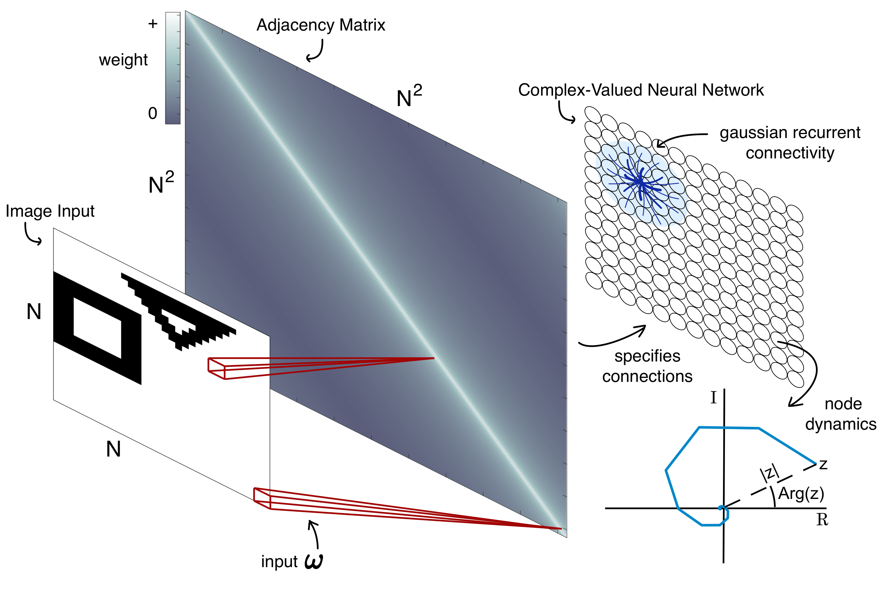
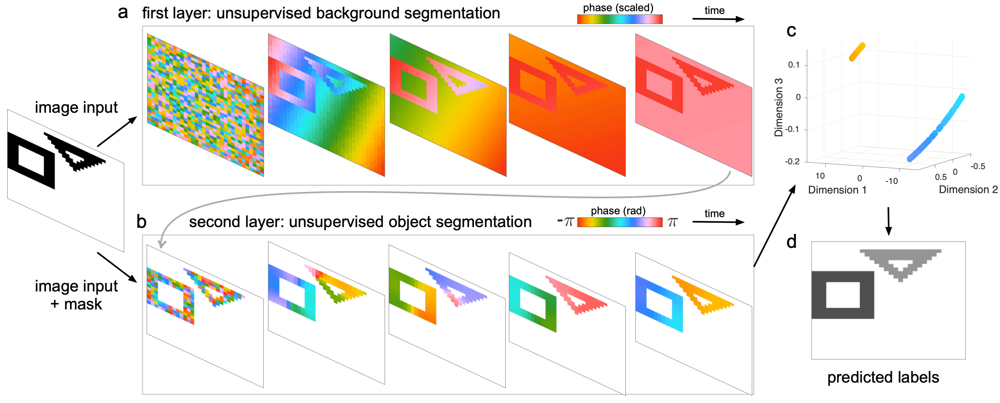
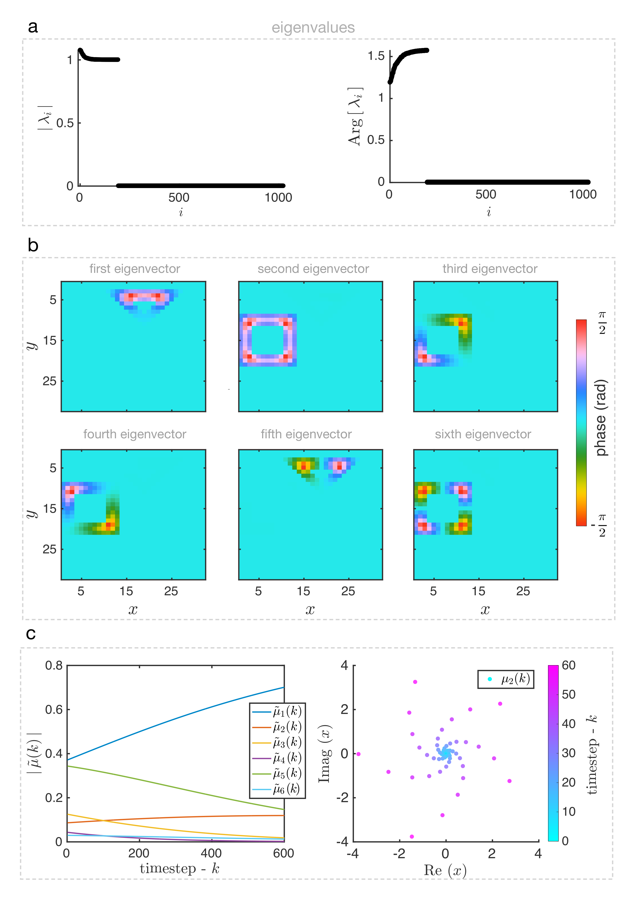

# Image segmentation with traveling waves in an exactly solvable recurrent neural network — selected excerpts (arXiv v1)

**Preprint version:** arXiv:2311.16943v1 [cs.CV], submitted 2023-11-28
**arXiv:** https://arxiv.org/abs/2311.16943
**Source verified:** `https://arxiv.org/e-print/2311.16943v1` (LaTeX tarball, `main.tex`, 767 lines), not just the PDF-to-Markdown conversion.

> **Editorial provenance (not part of the article).** These are **selected
> excerpts**, not the full text, of the v1 preprint — chosen because they are
> the passages [`04_paper_vs_matlab_drift.md`](04_paper_vs_matlab_drift.md)
> cites. Omitted: the introduction, Figs. 2/4/5/6 discussion and captions,
> the Discussion section, and the reference list. Emphasis (bold) in the
> Network Architecture quote below is added for this comparison; it is plain
> text in the source.
>
> Verified directly against `main.tex`'s `\subsection*`/`\section*` commands
> (there is no other kind of section break in this document):
> - **No Methods section exists in the v1 source**, in any form. The v1 main
>   text forward-references "(see Methods, Visual inputs, and data set)" and
>   "(see Supplementary Material, Sec. I)" at several points, but neither a
>   `Methods`/`Materials and Methods` section nor the referenced Supplementary
>   sections' text appear anywhere in `main.tex`. The explicit published
>   sentence "the dynamics in the second layer start from a new random
>   initial state $x_2(0)$" (present in
>   [`01_paper.md`](01_paper.md)'s Materials and Methods) has **no v1
>   preprint counterpart to compare against** — its text was written for, or
>   added during, PNAS submission/review; this cannot be confirmed either way
>   from what's public in the v1 arXiv bundle.
> - The v1 tarball **does** include two supplementary figure files
>   (`figures/FS1.pdf`, `figures/FS2.png`, matching *SI Appendix* Figs. S1/S2)
>   with no accompanying caption or body text in `main.tex` — the figures
>   were prepared before the text describing them was finalized, or that text
>   was omitted from this upload. There is no *SI Appendix*-style parameter
>   table (window ranges, $\alpha$/$\sigma$ per figure) anywhere in the v1
>   bundle, so [`02_supplementary.md`](02_supplementary.md) section X's table
>   has no preprint-era counterpart to diff against either.
> - All nine figure files from the v1 tarball (`F1`–`F6`, `FS1`, `FS2`, and an
>   unreferenced `FM1`) are kept locally under
>   [`00_figures/`](00_figures/), renamed `arxiv.2311.16943v1.fig0N.png` /
>   `figSN.png`; PDF-only figures were rasterized (`pymupdf`), others are the
>   authors' original PNGs. `FM1` is not cited anywhere in `main.tex` — see
>   [`04_paper_vs_matlab_drift.md`](04_paper_vs_matlab_drift.md) section 6.

## Authors

Luisa H. B. Liboni, Roberto C. Budzinski, Alexandra N. Busch, Sindy Löwe, Thomas A. Keller, Max Welling, and Lyle E. Muller

## Abstract

We study image segmentation using spatiotemporal dynamics in a recurrent neural network where the state of each unit is given by a complex number. We show that this network generates sophisticated spatiotemporal dynamics that can effectively divide an image into groups according to a scene's structural characteristics. Using an exact solution of the recurrent network's dynamics, we present a precise description of the mechanism underlying object segmentation in this network, providing a clear mathematical interpretation of how the network performs this task. We then demonstrate a simple algorithm for object segmentation that generalizes across inputs ranging from simple geometric objects in grayscale images to natural images. Object segmentation across all images is accomplished with one recurrent neural network that has a single, fixed set of weights. This demonstrates the expressive potential of recurrent neural networks when constructed using a mathematical approach that brings together their structure, dynamics, and computation.

## Network architecture

The cv-RNN is arranged on a two-dimensional square lattice with a side length of *N* nodes. Each node in the network receives input from one pixel of an image (Fig. 1). Nodes in the oscillator network are densely connected with their local neighbors ("Gaussian recurrent connectivity"), approximately following the connectivity that occurs in single regions of visual cortex. We consider a specific dynamical equation for the evolution of this system of *N²* nodes:

$$\dot{\psi}_i(t) = \omega_i + \epsilon \sum_{j=1}^{N^2} a_{ij} \left[ \sin(\psi_j(t) - \psi_i(t)) - i \cos(\psi_j(t) - \psi_i(t)) \right], \tag{1}$$

where $\psi_i(t) \in \mathbb{C}$ is the state of node $i$ at time $t$, $\omega_i \in \mathbb{R}$ is the node's intrinsic oscillation frequency, the matrix element $a_{ij} \in \mathbb{R}$ is the connection between nodes $i$ and $j$, and $\epsilon \in \mathbb{R}$ scales the strength of all connections.

By defining the change of variable,

$$x_i(t) = e^{i\psi_i(t)} = e^{-\mathrm{Im}(\psi_i(t))} e^{i\,\mathrm{Re}(\psi_i(t))} = |x_i(t)|\,\mathrm{Arg}[x_i(t)], \tag{2}$$

we find that Eq. (1) admits an exact solution. Now, taking the system in discrete time, we can express the solution as

$$x(k+1) = \underbrace{\left(\mathrm{diag}(i\omega) + \epsilon A\right)}_{B} x(k), \tag{3}$$

in matrix form, where $A \in \mathbb{R}^{N^2 \times N^2}$ contains the connections in the network.

Connections in the recurrent layer have strength that decreases with their Euclidean distance $d_{ij}$ between two nodes on the square lattice:

$$a_{ij} = \alpha \exp\left(-\frac{d_{ij}^2}{2\sigma^2}\right), \tag{4}$$

where $\alpha \in \mathbb{R}$ sets the peak strength of connections, and $\sigma \in \mathbb{R}$ controls how fast connection strength falls off with distance. **Throughout this work, the cv-RNN starts with random initial conditions, with node amplitudes $|x_i(0)|$ distributed uniformly in the interval $[0,1]$ and phases $\mathrm{Arg}[x(0)]$ uniform in $[-\pi, \pi]$.**

## Object segmentation algorithm

Having observed that recurrent interactions can produce traveling wave patterns unique to each object, we next developed an algorithm to segment objects using these dynamics. This algorithm uses a two-layer implementation of the cv-RNN, where the first layer separates image objects from the background. Connection patterns specific to each layer facilitate this process: in the first layer, the recurrent connections have a higher peak strength $\alpha$ and a broader spatial scale $\sigma$; in the second layer, nodes assigned to the background are disconnected from the rest of the recurrent layer, and the remaining recurrent connections have lower $\alpha$ and a smaller spatial scale $\sigma$.

*(As established from the v1 LaTeX source above: no Methods section, describing the layer-2 initial condition or a numerical parameter table with time windows, exists anywhere in this preprint. Compare [`01_paper.md`](01_paper.md)'s Materials and Methods section and [`02_supplementary.md`](02_supplementary.md) section X, which do have this content.)*

With this approach, the two-layer cv-RNN robustly segments objects in the set of inputs with two geometric objects in the test dataset. On average, 93% of pixels in 1000 images of two non-overlapping geometric shapes were correctly clustered, and 86% in 1000 images of three non-overlapping geometric shapes, comparable to the range reported in previous work. These results demonstrate that the cv-RNN developed here enables generalization to inputs where objects are not in the same position of the image, but can have rotation or translation.

## Exact solution and eigendecomposition

$$x(k) = B^k x(0) = \sum_{i=1}^{N^2} \underbrace{\lambda_i^k (r_i^T x(0))}_{\mu_i(k)} v_i, \tag{7}$$

where $\lambda_i$ are the eigenvalues associated with eigenvectors $v_i$ of $B$, $r_i^T$ are the rows of $[v_1 \cdots v_{N^2}]^{-1}$, and coefficients $\mu_i(k)$ weight the contribution of each eigenvector.

## Code availability

An open-source code repository for this work is available on GitHub: http://mullerlab.github.io.
